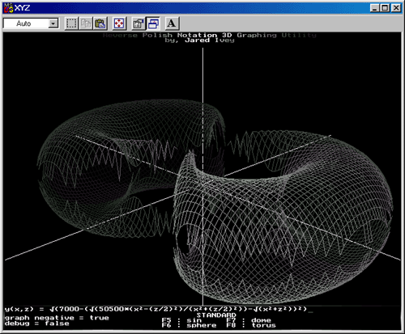

# XYZ - 3D Function Graphing Utility

[![Platform: DOS 6.22](https://img.shields.io/badge/DOS_6.22-020880?style=flat-square&logo=data:image/svg%2bxml;base64,PD94bWwgdmVyc2lvbj0iMS4wIiBlbmNvZGluZz0iVVRGLTgiPz4KPCEtLSBDcmVhdGVkIHdpdGggSW5rc2NhcGUgKGh0dHA6Ly93d3cuaW5rc2NhcGUub3JnLykgLS0+Cjxzdmcgd2lkdGg9IjQ4MCIgaGVpZ2h0PSI1MTIiIHZlcnNpb249IjEuMSIgdmlld0JveD0iMCAwIDQ4MCA1MTIiIHhtbG5zPSJodHRwOi8vd3d3LnczLm9yZy8yMDAwL3N2ZyIgeG1sbnM6eGxpbms9Imh0dHA6Ly93d3cudzMub3JnLzE5OTkveGxpbmsiPgogPGltYWdlIHdpZHRoPSI0ODAiIGhlaWdodD0iNTEyIiBpbWFnZS1yZW5kZXJpbmc9Im9wdGltaXplU3BlZWQiIHByZXNlcnZlQXNwZWN0UmF0aW89Im5vbmUiIHhsaW5rOmhyZWY9ImRhdGE6aW1hZ2UvcG5nO2Jhc2U2NCxpVkJPUncwS0dnb0FBQUFOU1VoRVVnQUFBZUFBQUFJQUJBTUFBQUNvVnFLNUFBQUFKMUJNVkVVQUFBQUFBQUFBQUFEL0FBRC8vd0RBCndNQ0FnSUNBZ0FBQUFQK0FBQUQvQVA4QUFJQ0FBSUJJdFhFOEFBQUFBWFJTVGxNQVFPYllaZ0FBQThOSlJFRlVlTnJ0M2NGeEd6RU0KQlZEVm9oYlNRbHB3QzJsQkxhUUZ0ZUFXM0VLS3ltVTVrMEVHQW9tbGxZejEvazN4RXF1M09SSGtVcGZMa1d1UlN6Tm42MTRuOC9RdgpCZ3dNREF3TURBd01EQXdNRFB5bHdHOGhQNDZzRnU3V2k1QzNJckhlOVBjRUJnWUdCZ1lHQmdZR0JnWUdCbjd3QlVjK0d6eDdmZlZBCnB2K0RnSUdCZ1lHQmdZR0JnWUdCZ1lFbndMT0Z1blhpdU83OWdJR0JnWUdCZ1lHQmdZR0JnWUhQZ01mQTFVYkF2d0l2Ynh3SEJnWUcKQmdZR0JnWUdCZ1lHQm41d3d3anZMbWgzd2RXQytLVWJZR0JnWUdCZ1lHQmdZR0JnWU9DSkNYalZDS2l1Mi8zQ2RQdEZhV0JnWUdCZwpZR0JnWUdCZ1lHRGdCWEQzZ2JRM2NCY0wzdTBYcFlHQmdZR0JnWUdCZ1lHQmdZR0JUNEN6Q1g0WHZMcmdmUm9PREF3TURBd01EQXdNCkRBd01ETHp3d25KMjNleEMrZW9HODFVNE1EQXdNREF3TURBd01EQXdNUEF6d0tzYng3dmc3UXZqd01EQXdNREF3TURBd01EQXdNQ04KaVhTOGZ2YTYxYnF6MmI1QkhCZ1lHQmdZR0JnWUdCZ1lHUGhMZzYrYmM3YnVydkhBd01EQXdNREF3TURBd01EQXdEUGdieWR6UHpMcQovVHp5ZnFUNi9IRmtqUC9lVFBrQWdJR0JnWUdCZ1lHQmdZR0JnWUUzZ1A4WGFQVUFnSUdCZ1lHQmdZR0JnWUdCZ1lGM2dydlE4Zm16Cm9Da2NHQmdZR0JnWUdCZ1lHQmdZR0hnQ2ZDOHl4a2ZJcnlQWlJ1NzQ5OWtGN2l5M0kzSDgrSGRnWUdCZ1lHQmdZR0JnWUdCZzRCM2cKV1dqV01LZ1d3dU4xV2VNZ3JuUGZrZ0FEQXdNREF3TURBd01EQXdNRHI0Q3JpWGUxNFh1MlhnWWVEekRlSjNzaHVqeFlEQmdZR0JnWQpHQmdZR0JnWUdCaDRBWndWN2pZQXNvbjdhZ01naFhVUDFBWUdCZ1lHQmdZR0JnWUdCZ1lHbmdCM0d3Qlp2YmlBWFRVQXRoK29EUXdNCkRBd01EQXdNREF3TURBejhoQVpBdGFCZE5RQzJINmdOREF3TURBd01EQXdNREF3TURQekVCa0JXdjJvQVpBZUh0US9VQmdZR0JnWUcKQmdZR0JnWUdCZ1p1TkFEaUJINjEzbW9EWUJZT0RBd01EQXdNREF3TURBd01ETHdEbk1HemV2RWc3amkrK3FMWlFkcXJkWUNCZ1lHQgpnWUdCZ1lHQmdZR0JyeHQrYjZtYThFZG9sdGtKZkpidEMrTEF3TURBd01EQXdNREF3TURBTHcwK213Zyt1OUY3TmNzL3VBd01EQXdNCkRBd01EQXdNREF3TWZDSnhnaDZoY1lIN0ZySUxDZ3dNREF3TURBd01EQXdNREF6OERIQTE0VitGcno2QWJEd3dNREF3TURBd01EQXcKTURBdzhDUHdmVk5HM1hFZzlqZ0lyUHBjd1ZmejF3dld3TURBd01EQXdNREF3TURBd01CL2dIZERSMmFodStEeC91bUpaOERBd01EQQp3TURBd01EQXdNQXZEYTUrNEdrMXUrcDJ4MTltQXd3TURBd01EQXdNREF3TURQeks0TjlJcXA0UkVoZkFZZ0FBQUFCSlJVNUVya0pnCmdnPT0KIi8+Cjwvc3ZnPg==)](https://en.wikipedia.org/wiki/MS-DOS)

XYZ is a 3D graphing utility originally written in 1998 using Turbo Pascal. It was designed to render mathematical surfaces within a DOS environment.

## How it Works
XYZ achieves its 3D visualization through the coordination of three primary components:

* **Main Engine (`XYZ.pas`):** Handles the user interface, the main rendering loop, and the final output to the screen.
* **RPN Library (`RPN.pas`):** To maximize rendering speed, the utility converts standard mathematical equations into [Reverse Polish Notation](https://en.wikipedia.org/wiki/Reverse_Polish_notation). This allows the program to evaluate the graph points rapidly using a stack-based approach, avoiding the overhead of repeated expression parsing.
* **Matrivex Library (`Matrivex.pas`):** A custom matrix and vector math library that handles the heavy lifting of 3D linear algebra. This library is responsible for the 3D rotations and the perspective scaling that creates the illusion of depth.

## Visuals & Rendering
The project utilizes a **wireframe rendering** style with a built-in **perspective projection** to create a sense of depth. To enhance the 3D effect, it employs depth-based shading:
* **Foreground:** Objects closer to the viewer are rendered larger and in a lighter gray.
* **Background:** Objects further away are rendered smaller and in a darker gray.

## Technical Specifications
* **Language:** Turbo Pascal
* **Environment:** DOS
* **Input:** Standard algebraic equations (converted to RPN internally)
* **Rendering:** Wireframe with perspective projection and depth cueing (shading based on distance).
* **Key Components:** 
    * **Matrivex:** Custom library for 3D rotations and perspective projections.
    * **RPN Evaluator:** Custom implementation for high-speed equation processing.

> [!IMPORTANT]
> ## Developer's Note
> This project was pushed to the limits of the Turbo Pascal memory model. Due to the recursive nature of the RPN evaluation and the complexity of the 3D rendering, the default stack sizes (8KB and 16KB) resulted in stack overflows. The code was ultimately configured to use the largest stack size permitted by the compiler to ensure stability.

## Running the Code
Because this project was written for a DOS environment, you will likely need a legacy compiler or an emulator such as **DOSBox** to compile and run the source code on modern hardware. Once compiled, run the resulting `XYZ.EXE` from the DOS prompt.

## License
This project is licensed under the MIT License - see the [LICENSE](LICENSE) file for details.
